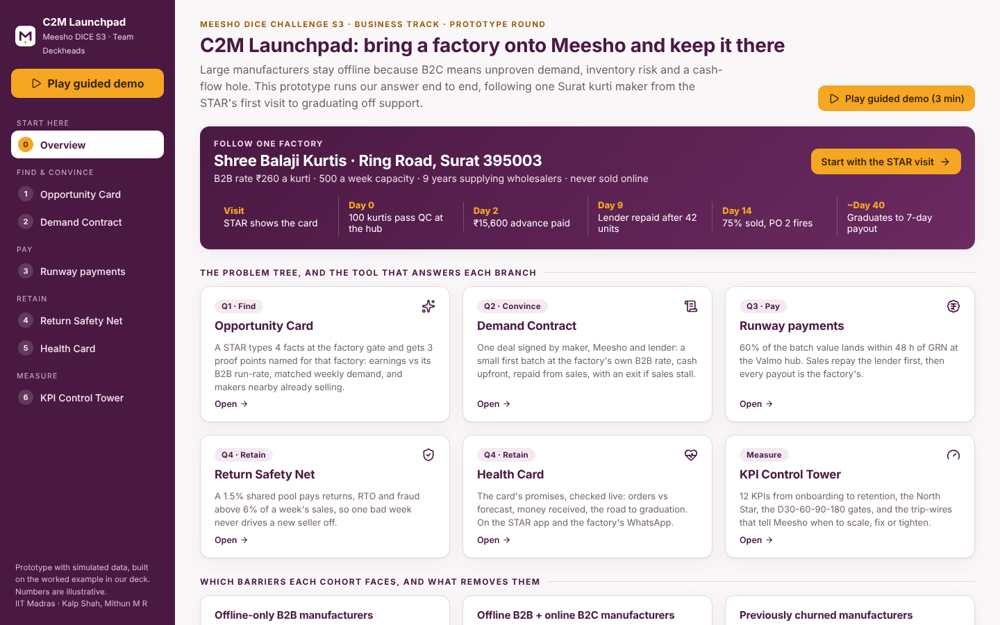
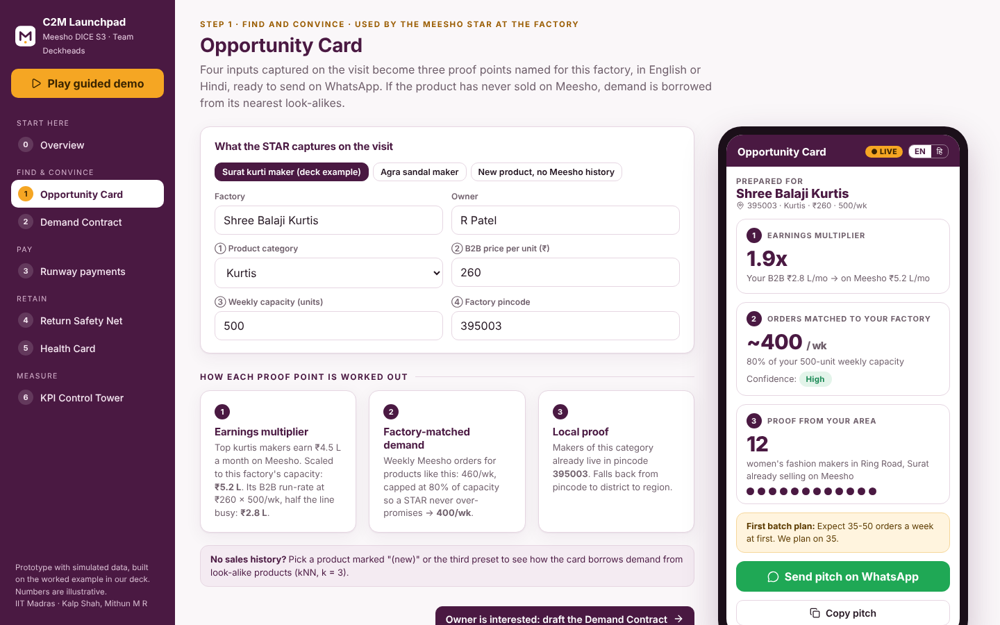
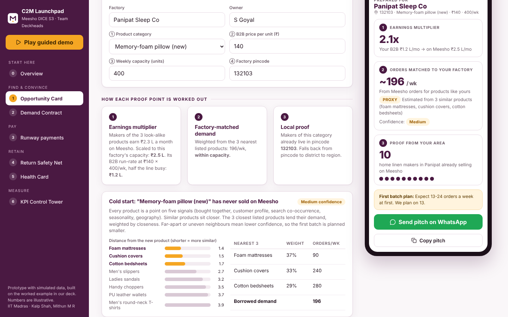
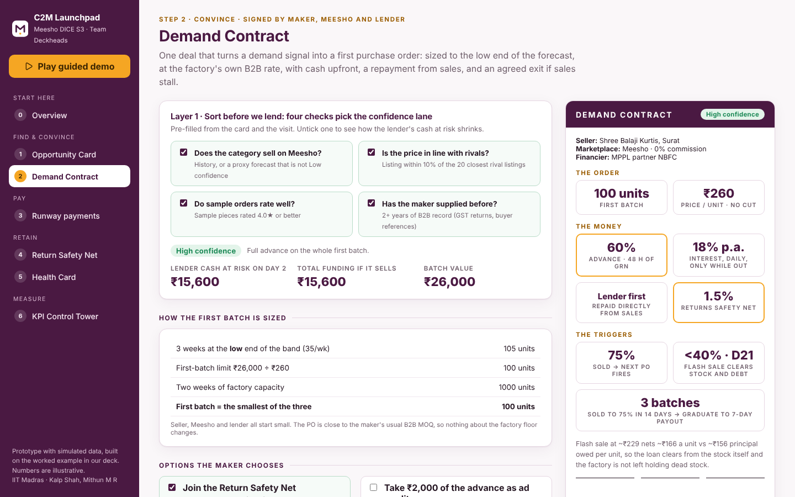
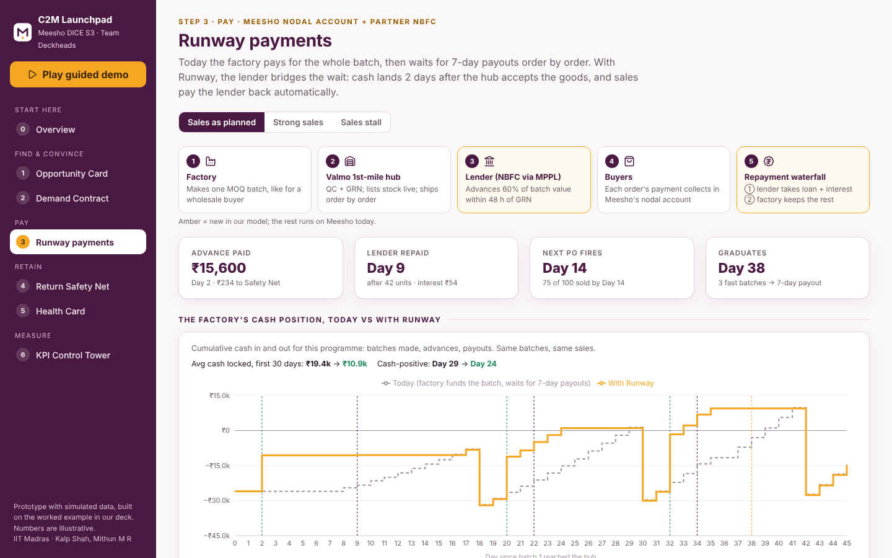
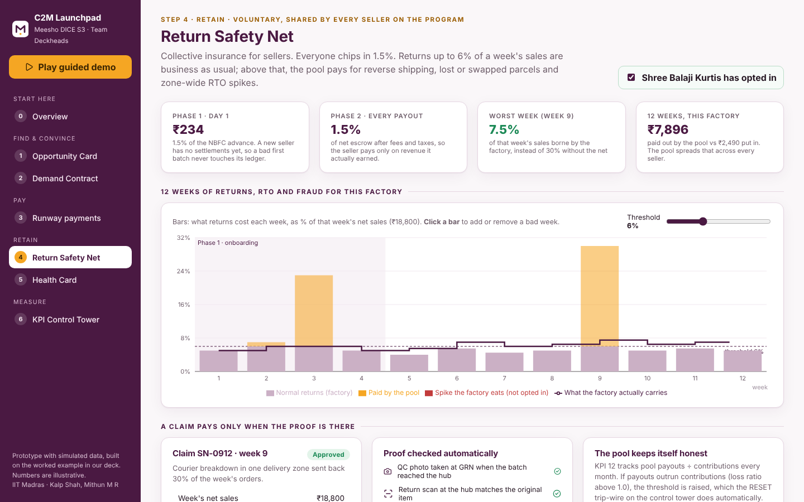
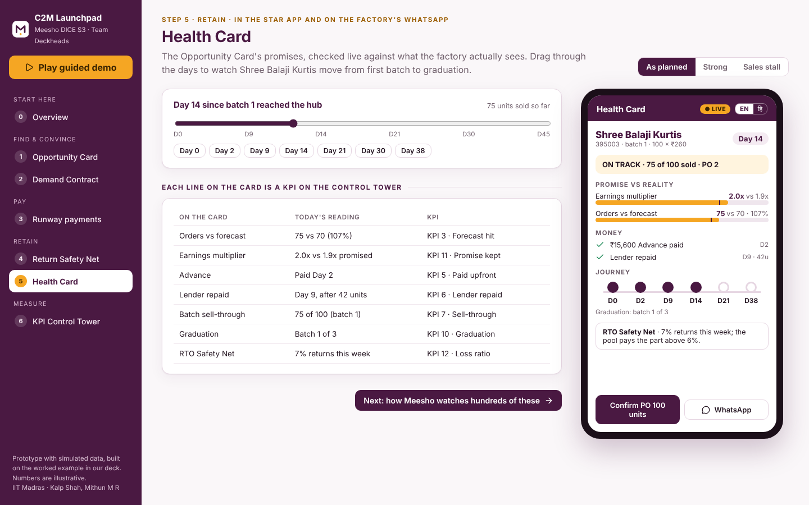
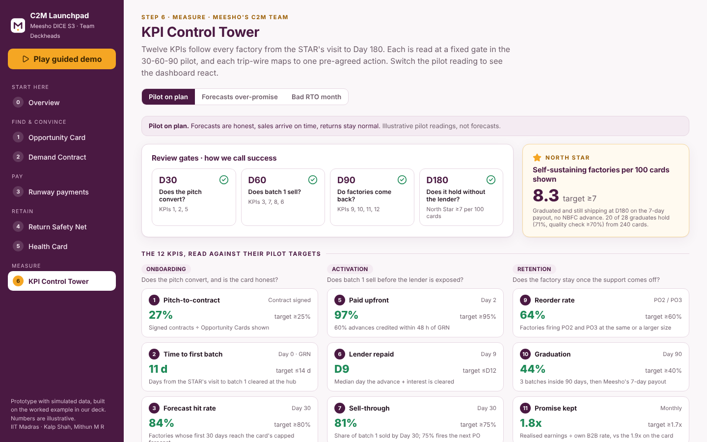
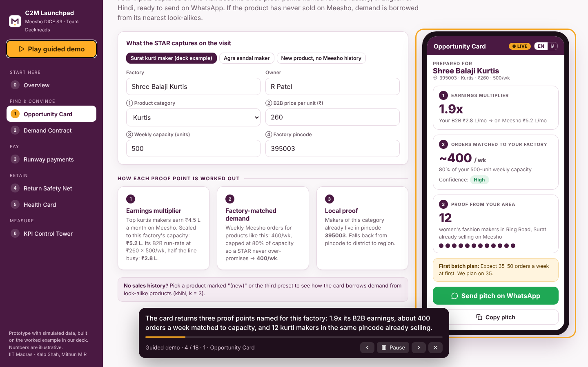

# C2M Launchpad

**Team Deckheads · IIT Madras · Meesho DICE Challenge S3 · Business track: Building Meesho's Consumer-to-Manufacturer (C2M) base**

A working prototype of our solution: bring a reluctant offline manufacturer onto Meesho, and keep them there without subsidies or manual handholding that can't scale.

**▶ Live demo:** https://github.com/SubwayAstronomer/Deckheads_IIT_Madras_SG &nbsp;·&nbsp; **🎬 Video:** [`demo.mp4`](demo.mp4) &nbsp;·&nbsp; **📄 Deck:** Deckheads_IIT Madras

> Open the live demo and press **Play guided demo**. It walks the whole story in about 3 minutes.



---

## The problem, in one line

Large manufacturers stay offline because B2C means **unproven demand**, **inventory risk** and a **cash-flow hole**. Those who do join get weak early orders and leave before the channel proves itself.

## Our answer: four tools, one control tower

We follow one factory through the whole journey: **Shree Balaji Kurtis, Ring Road, Surat 395003** (₹260 B2B rate, 500 pieces a week, 9 years supplying wholesalers, never sold online). This is the worked example in our deck.

| # | Question (deck slide 5) | Tool | What you can do in the prototype |
|---|---|---|---|
| 1 | **Find:** which makers, and how do we pitch them? | **Opportunity Card** | Enter 4 facts (product, B2B price, weekly capacity, pincode) and get 3 proof points: earnings multiplier, matched weekly demand, makers nearby already selling. English / हिन्दी. Send on WhatsApp. New products borrow demand from their 3 nearest look-alikes (kNN). |
| 2 | **Convince:** how do we de-risk the first batch? | **Demand Contract** | Four checks sort the maker into a confidence lane (high / mid / low). The first batch is sized and the terms are filled in, and all three parties sign. |
| 3 | **Pay:** how does each party get paid? | **Runway payments** | Day-by-day simulation: 60% advance within 48 h of GRN, lender repaid first from sales, automatic reorder at 75% sold, Day-21 flash sale if sales stall, graduation after 3 fast batches. Cash curve today vs with Runway. |
| 4 | **Retain:** what stops one bad week killing a new seller? | **Return Safety Net** | 12-week view of returns/RTO/fraud: the factory carries up to 6%, a shared 1.5% pool pays the rest. Click bars to add spikes; move the threshold. |
| 4 | **Retain:** is the promise being kept? | **Health Card** | What the factory sees on WhatsApp: orders vs forecast, money received, journey to graduation. Drag through Day 0 to Day 45. |
| – | **Measure:** is it working, and when do we step in? | **KPI Control Tower** | The 12 KPIs with pilot targets, D30/60/90/180 gates, the North Star (self-sustaining factories per 100 cards ≥ 7) and the five trip-wires (SCALE, FIX, TIGHTEN, RESET, HOLD). |

Every screen reads from the same factory, so a change on the Opportunity Card flows into the contract, the cash simulation, the Safety Net and the Health Card.

## Screens

| Opportunity Card | Cold start (kNN proxy) |
|---|---|
|  |  |
| **Demand Contract** | **Runway payments** |
|  |  |
| **Return Safety Net** | **Health Card** |
|  |  |
| **KPI Control Tower** | **Guided demo** |
|  |  |

## The worked example matches the deck

The prototype reproduces the numbers on our slides. These are checked by automated tests (`tests/engine.test.ts`), so the app and the deck can't drift apart:

| Deck says | Prototype |
|---|---|
| Opportunity Card: **1.9x** earnings (B2B ₹2.8 L/mo vs Meesho ₹5.2 L/mo), **~400/wk** matched (80% of capacity), **12** makers in 395003 | ✅ |
| Contract: **100 units × ₹260**, **₹15,600** advance (60%) | ✅ |
| Advance paid **Day 2**, lender repaid **Day 9 after 42 units**, interest **~₹54** | ✅ |
| **75 sold by Day 14**, so PO 2 fires | ✅ |
| Flash sale at **~₹229 nets ~₹166** vs **₹156** principal per unit | ✅ |
| Mid-confidence lane: **₹2,600** pilot lot, **₹10,400** released later | ✅ |
| Safety Net: a **30% returns week costs the factory 7.5%** | ✅ |
| Graduation after 3 batches in **~6 weeks** | ✅ (Day 38) |

## How the logic works (kept deliberately simple)

All logic lives in `src/engine/` as plain TypeScript functions with no UI code, so a judge can read them in a few minutes.

- **`opportunityCard.ts`**: multiplier = top makers' Meesho earnings scaled to this factory's capacity ÷ its B2B run-rate (price × capacity × 4.33 weeks × 50% utilisation). Matched demand = weekly orders for similar products, capped at 80% of capacity. For a product with no history, demand is the inverse-distance-weighted average of its 3 nearest listed products on 5 similarity signals.
- **`contract.ts`**: 4 checks → lane. First batch = min(3 weeks at the low end of the band, ₹26k ÷ price, 2 weeks of capacity). 60% advance, 18% p.a. daily interest, 1.5% Safety Net, 75% reorder, Day-21 / 40% clearance, graduate after 3 batches sold to 75% within 14 days.
- **`runway.ts`**: day-by-day loop: batch reaches the hub → advance on Day 2 → each sale's net payout goes to the nodal escrow → lender repaid when escrow covers principal + interest → the rest flows to the factory. The same sales are run under today's model (factory self-funds, 7-day payout) for comparison.
- **`safetyNet.ts`**: weekly losses as % of net sales; factory carries up to the threshold, the pool pays the excess; contributions of 1.5% of the advance on day 1, then 1.5% of each payout after graduation.
- **`cohort.ts`**: the 12 KPI definitions, targets, gates and trip-wire rules, with three illustrative pilot readings.

Data is simulated and listed in `src/data/`. Category inputs and manufacturer quotes come from our primary research (deck slides 3 and 12). Every assumption is listed in [`docs/ASSUMPTIONS.md`](docs/ASSUMPTIONS.md).

## Run it locally

```bash
npm install
npm run dev        # http://localhost:5173
npm test           # checks the deck numbers
npm run build      # production build in dist/
```

No backend and no API keys. It's a static site.

Prefer not to install anything? `npm run build:preview-file` writes one self-contained `dist-file/index.html` you can double-click.

## Deploy (GitHub Pages)

1. Push this repo to GitHub (branch `main`).
2. **Settings → Pages → Source: GitHub Actions.**
3. The included workflow (`.github/workflows/deploy.yml`) runs the tests, builds and publishes. Replace `YOUR-GITHUB-USERNAME` in the live-demo link above.

## Repo layout

```
src/
  engine/        all business logic (pure functions)
  data/          simulated catalogue, pincodes, categories + cohort barriers from the deck
  pages/         one file per screen
  demo/          in-app guided demo (Play guided demo button)
  i18n/          English / Hindi strings for factory-facing screens
  state/         the shared "one factory journey"
tests/           tests that pin the prototype to the deck's numbers
docs/            assumptions, screenshots
```

## What this prototype does not do

Being honest about scope: it does not touch **tax anxiety**, **channel conflict** or **copycat listings** (marked "Not solved here" on the Overview). Demand, pincode counts and the pilot readings are simulated. In production, the Opportunity Card would read Meesho's catalogue and order data, the advance would run through MPPL's partner NBFC, and the Health Card would be a WhatsApp template.

---

Team Deckheads, IIT Madras: **Kalp Shah**, **Mithun M R**. Built for the Meesho DICE Challenge S3 prototype round.
